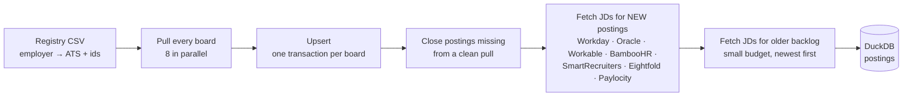

# jobsearch

Read job postings straight from employers' own applicant tracking systems (ATS) into a local DuckDB database, track each posting from the day it appears to the day it's taken down, and find the ones worth applying to with SQL.

## Why read the ATS directly

Job aggregators re-list postings that closed weeks ago, and their links often dead-end. LinkedIn search is noisy and hides the posting date. The employer's ATS is the only source that is always current: if a req is on the Workday or Greenhouse board, it's open, and when it disappears, it's closed.

Most large ATS platforms serve their public career sites from a JSON endpoint. This project calls those same endpoints, the ones your browser calls when you visit the careers page, for a list of employers you choose. No login, no API keys, no parsing of rendered page content. The one exception is Paylocity, whose public feed is often disabled, so the adapter reads the JSON block the all-jobs page embeds for its own script, and one description block from each job's page.

What you get:

- **A live picture of every board you care about.** One run pulls every posting from every registered employer.
- **History.** Each posting records when it was first seen, last seen, and taken down. Nothing is ever deleted.
- **A growing corpus of full job descriptions.** It's useful for term-frequency analysis (TF-IDF), resume keyword work, or tracking how an employer's hiring shifts.
- **Filtering in SQL** instead of a search box. See [Querying](#querying).

## How a run works



1. **Pull.** Each registered board is read in full, with no job cap. Boards run eight at a time. Pages within one board run one after another with a short delay, so no single host gets more than about one request per second.
2. **Upsert.** Every posting has a stable ID made from employer, platform, and the ATS's own req ID. A posting already in the database is updated in place. A new one is inserted with `first_seen_at` set. A board's writes go through a staging table in a single transaction.
3. **Close.** Any active posting that didn't appear in this pull is marked `status = 'closed'` with a `closed_at` timestamp. This only happens when the board was pulled cleanly and completely. A failed or truncated pull closes nothing. A closed posting that reappears is reopened.
4. **New-posting details.** Some platforms' list endpoints return only a title and a location. For those, every posting that is new this run gets its detail page fetched automatically: full description, every location, exact dates, and pay when the text states it. A safety cap (`--new-detail-cap`, default 5,000) matters only on a board's first-ever sweep, when every posting counts as new. The overflow goes to the backlog.
5. **Backlog details.** A budget (`--detail-budget`, default 2,000) works through older postings still missing a description, newest first. It is prioritized by a title regex in `backend/ats/prefilter.py`. That regex decides what gets fetched *first*, never what gets stored.

A detail request that returns 404 closes the posting, so the detail stage doubles as a liveness check.

### What a run looks like

One line per board, then the detail stage, then a run summary. This is from a real run, trimmed:

```text
  [119/125] McKesson (workday): 484 live, 484 new, 0 reopened, 0 taken down — 21.5s
  [120/125] Wells Fargo (workday): 1719 live, 0 new, 0 reopened, 5 taken down — 89.5s
  [123/125] Philips (workday): 823 live, 0 new, 0 reopened, 0 taken down — 70.5s
  [125/125] CVS Health (workday): 19449 live, 18453 new, 0 reopened, 4 taken down — 663.1s
Detail stage: fetching 300 JDs (6 workers)...
  CVS Health: 77 JDs, 0 gone, 0 errors
  Novartis: 103 JDs, 0 gone, 0 errors
  Accenture: 120 JDs, 0 gone, 0 errors
Detail stage done: 300 fetched, 0 closed as gone, 0 errors.

Run b2213154 done in 17.4 min: 124 boards ok, 1 failed, 76431 live postings, 54941 new, 0 reopened, 111 taken down, 300 JDs fetched
```

`new` on a board's first sweep is every posting on it (McKesson, CVS above). On later runs it is only what appeared since the last run (Wells Fargo). `taken down` is the close pass at work. A board that fails shows up in `vw_board_health`, and nothing on it is closed.

## How the pipeline flows

The sweep above fills the database. The finder then works down it in ten steps. The full design, with the feedback loop and the rulings behind it, is in [`docs/SPRINT_PLAN.md`](docs/SPRINT_PLAN.md) §22.

| # | Step | What it does |
|---|---|---|
| 1 | Sweep | Reads whole employer boards. New postings are added once, vanished postings are closed, nothing is deleted. |
| 2 | JD details | Fetches the full description for every new posting, then works down the backlog of older postings whose title matches a keyword list. |
| 3 | Tracker sync | Mirrors your application tracker and reads back build / pass decisions, so decided postings leave the report. |
| 4 | Screen | A rule engine (title, location or remote, pay floor, held clearance, level), then TF-IDF models: three lenses, `required` and `bullseye`. With a JD, the best lens score decides and a title-only reject is overturned. |
| 5 | Coverage | Splits each survivor's JD into requirement lines and matches them to your evidence record. |
| 6 | Second layer | Embeds the Required block of the high scorers and names the requirement line most likely to be unmet. |
| 7 | LLM second judge | Built, not run. Reads the full JD and a public-safe background document and makes a strict, independent Required-block call. Must be scored blind against human-graded rows before it may move the rank -- see below. |
| 8 | Report | Every score visible, one Rank, one Why. |
| 9 | Human review | You read the report and decide what to build and what to pass on. |
| 10 | Feedback write-back | Every decision goes back into the database with a reason, and the models learn from it at the next retrain. |

The weekly retrain is one command: `finder.py retrain`. It trains the three lenses plus `required` and `bullseye` as candidates, gates each one on employer-grouped held-out AUC (must not fall more than 0.02 below the previous promoted run), a shuffled-label leak check, and its label count (must not fall) -- a model that fails keeps the old artifact and the run says which gate failed, with the numbers. `required-embed train` runs too, gated by its own acceptance check. Only if at least one model was promoted does it rescreen everything, recompute coverage, and rescore `required-embed`. Every attempt, promoted or not, is logged to the `model_runs` ledger; `finder.py retrain --history` prints it. `--dry-run` trains and scores every candidate, logs it, and promotes and rescreens nothing. `sweep_ats.py` prints one reminder line, never fails the sweep, when the newest promoted run is more than 7 days old or 25+ new human labels have arrived since.

Two rules keep the loop honest. Grade first, reveal second: a grade given before any machine score is on screen is recorded as `blind`, and only blind rows are used to evaluate the models. And a pass for logistics or pay never trains a fit model, because the work can be right when the location is wrong.

`finder.py mark` is how step 10 actually writes back. A plain `mark <target> pass --reason "logistics: not commutable"` still just records the decision. Adding `--reason "requirement: ..." --unmet "<the line, quoted from the JD>"` (repeatable) tells it a hard Required line was not met, which outranks the judge's own Required-block call everywhere that call is read, exactly the way a human lane grade already outranks the judge; `--reason "clearance: ..."` is an alias for `requirement`. `mark <target> build` writes a human required_fit of `meets` unless `--unmet` says otherwise. `--grade bullseye|adjacent|stretch|wrong` records a human lane grade through the same path as the golden feedback CSV import, and `--basis blind|seen` (default `seen`) records whether the grade was given before the machine scores were on screen. A whole review session can be applied at once with `finder.py mark --from-file decisions.csv` (columns: `posting,decision,reason,unmet,grade,basis`, `unmet` values joined with ` || `) -- the file is validated in full before anything is written, and one bad row aborts the whole file rather than applying part of it.

Review feedback is top-heavy -- only postings that already ranked high get a human look, so it can measure precision at the top but never a miss (a good job buried lower, or wrongly screen-rejected). `finder.py feedback sheet --n 20 [--seed S] [--out PATH]` writes a small blind grading CSV once a month with NO rank, verdict, reason or flag on it: 8 rows from the top 50 by Rank, 6 from ranks 200-600, and 6 screen rejects with a JD (2 each whose reject reason is location, clearance or title, falling back to any reject when a bucket is short), shuffled, one row per posting per (employer, normalized title), excluding anything already graded or decided. Fill in `human_grade`, `required_fit`, `required_unmet`, `level_fit`, `note` by hand, then `finder.py feedback sheet-import PATH` writes the grades back through the same `report_feedback` path the golden-source CSV uses (`basis='blind'`), bridges any `required_fit` into `llm_labels` the same way `mark` does, and prints precision at the top, the miss rate in the 200-600 band, and the false-reject rate per rule bucket -- appended, timestamped, to `db/blind_sheet_history.jsonl`.

### Gold-sheet ingest

Hand-graded sheets accumulate outside the repo in several header shapes -- only the golden-source wide CSV
above was ingestible before `finder.py feedback ingest PATH [PATH ...] [--manifest FILE] [--basis blind|seen]
[--dry-run] [--accept-proposed]`. It detects the format from the header (case/whitespace/BOM-insensitive,
tolerates and logs unknown extra columns), normalizes enum values through a logged alias table (`to_low` ->
`too_low`, `stretch` -> `stretch_up`, `out_of_range` -> `out_of_reach` for `level_fit`; anything still outside
the enum rejects that ROW only, with file/line/posting_id/value), and writes through the same
`feedback.write_records` path the golden CSV and the blind sheet use. A narrow sheet (no `basis` column of
its own) requires `--basis` or a manifest row's own `basis` -- there is no default, because blurring blind vs
seen would defeat the whole point of the distinction (sprint plan §22.4). `--manifest FILE` reads a
`path,basis,notes` CSV (paths relative to the manifest's own directory; see `docs/gold_manifest.example.csv`)
so a full re-ingest is one command. When the same posting is graded more than once (across files in one run,
or already in the DB), the later file's grade/level/note win, but a `required_fit` is never overwritten by a
later row that lacks one, and a row's `basis` never moves from `blind` to `seen` or back -- a conflict is
reported, not silently resolved. A file whose header carries `proposal_confidence` is a machine-drafted
proposal, not a confirmed grading sheet, and is refused unless `--accept-proposed` is given. A derived
train/frozen split (`half`/`baseline_judge_grade` columns) is never ingestible and is always refused. A
single-lens (Applied-AI) grade sheet writes into its own `human_lens_grades` table (schema v19), keyed
`(posting_id, description_hash, lens)` -- NEVER into `llm_labels`, and never touching the posting's overall
grade, `required_fit`, or the other two lenses. A per-lens training view (`vw_label_set_process` /
`_technical` / `_ai`) substitutes a human lens grade for the judge's own on that one lens, source
`user_adjudicated`, only for the posting's CURRENT description_hash; the averaged `vw_label_set` (overall
grade) is unchanged. See `gold_ingest.ingest_f4` and `store.py`'s `human_lens_grades` table comment.
`--dry-run` runs detection, normalization and precedence resolution against the DB and writes nothing.
### The LLM second judge (§25) -- built, never called live from here

`backend/finder/judge2.py` sends one narrow, strict prompt per posting: the Required lines (parsed by the
existing requirement splitter, never re-parsed), the full JD (trimmed to a char cap, Required section
preferred), and a background document -- by default the public, neutral lens descriptions already committed
in `rubric.py` (`background="public"`), never anything from the gitignored personal rubric. A user-curated
fact sheet can be used instead (`background="file"`, path from `JUDGE2_BACKGROUND_FILE`; copy
`judge2_background.example.md` to the gitignored `judge2_background.local.md` and edit it). No posting_id
semantics, URL, pay, score or first-judge output is ever sent -- the second judge judges independently.

As of sprint plan §29, the model is never asked for an overall call -- it rates ONE JD line at a time (`line`,
`section`, `kind`, `verdict`, `evidence` for a `met`, `years` for a `years_function`), plus `held_clearance`
and `confidence`. Every `line` the model returns must be a verbatim substring of the JD text actually sent
(checked after the same whitespace normalization used for description hashing, nothing looser) or the entry
is discarded; a `met` verdict whose `evidence` is empty or not a verbatim substring of the background text
sent is downgraded to `unclear` rather than trusted. `derive_required_fit` (`backend/finder/judge2.py`) is a
PURE function that turns the surviving lines into one `required_fit` + a short `why`, so the §29.2 thresholds
can be tuned and every stored review re-derived with `finder.py judge2 rederive` -- no new API call. Stored
lines live in `judge2_lines` (schema v20); `judge2_reviews` keeps its §25 shape (`required_fit`/`unmet`/
`years_gap`, now filled from the derived call) so `vw_judge2_latest`/`vw_lens_fit` read it unchanged.
`finder.py judge2 run --dry-run --show 3` builds and prints full payloads and the rendered prompt, plus a
summary (postings, characters, estimated tokens, provider, model list), and calls nothing -- no API key
needed. A real call additionally requires `JUDGE2_LIVE_OK=1` in the environment or `--i-have-approval`, on top
of a dry run having already been read.

`finder.py judge2 eval` also prints a §29.4 line-level report against `vw_report_feedback_blind.required_unmet`
(each gold unmet line matched, by normalized containment, to a judge line and its verdict), and
`judge2 eval --compare <pv_a> <pv_b>` prints postings whose call differs between two stored prompt_versions --
run on two runs of the identical prompt (`judge2 run --rerun --run-tag <tag>`, which keeps the repeat's rows
separate instead of overwriting the first run's) this is the noise floor, not a real prompt change.

Before it can move anything, `finder.py judge2 eval` scores it against `vw_report_feedback_blind` only (grade-
first, reveal-second rows): it must catch at least 70% of the blind rows where the first judge said `meets`
and a human found a disqualifying unmet requirement (a second-judge `fails` or `partial` both count as a
catch), while agreeing (a second-judge `meets`, nothing softer) with at least 85% of the rows a human graded
`meets`. Below the bar, or with fewer than 5 judged rows in either set, it ships as a visible "J2" report
column only -- ONE Rank and ONE Why still come from human > second judge (once it clears the bar) > first
judge > models, computed once in `vw_lens_fit` and read everywhere the rank is used.

## Supported platforms

| Platform | List endpoint gives | Detail fetch | Registry identifiers |
|---|---|---|---|
| Workday | title, one location or "N Locations", relative date | yes | tenant, data center (`wd1`, `wd5`, …), site slug |
| Oracle Recruiting Cloud | title, locations, workplace type, dates, level | yes | host URL, site number |
| Greenhouse | everything, including description | not needed | board token |
| Lever | everything, including structured salary | not needed | company slug |
| Ashby | everything, including description | not needed | org slug |
| Workable | title, locations, workplace type, date | yes | account slug |
| BambooHR | title, location, department | yes | subdomain |
| SmartRecruiters | title, location, remote/hybrid, date, level | yes | company ID (case-sensitive) |
| Eightfold | title, locations, workplace flag, date, department | yes | host URL, domain |
| Paylocity | title, location, remote flag, department, date (from the JSON block embedded in the all-jobs page) | yes | company GUID, slug |
| USAJobs | everything, including full duties/qualifications, clearance, grade, pay | not needed | none — one registry row; needs `USAJOBS_API_KEY` + `USAJOBS_EMAIL` in `.env` |

USAJobs is the one adapter that is not a whole-board pull: it's a keyword search over `backend/profile.py`'s title phrases, so a posting missing from a run's results is never taken as evidence it's gone — only its own `ApplicationCloseDate` closes it. Missing credentials skip the adapter (one log line), they never fail the sweep. One registry row enables it regardless of `identifier_*` values (leave them blank).

**Not supported:**
- **iCIMS** answers scripted requests with a human-verification page.
- **Dayforce** returns 403 even with cookies and CSRF tokens.
- **Taleo** has no public JSON. Taleo Enterprise career sections increasingly redirect to a vendor front end, and Taleo Business Edition serves only rendered HTML.
- **Phenom, SuccessFactors, ADP, and UKG** have documented endpoints but no adapter yet. Rows on these platforms load but are skipped.

## Setup

Requires Python 3.11+.

```bash
git clone https://github.com/BensonJT/jobsearch.git
cd jobsearch
python3 -m venv .venv
.venv/bin/pip install -r requirements.txt
.venv/bin/python -m pytest -q          # unit tests, no network
```

A fresh clone runs against `registry/ats_registry.example.csv`, one example row per supported platform. Ten of the eleven need no API keys; the USAJobs row needs `USAJOBS_API_KEY` + `USAJOBS_EMAIL` and is skipped, not failed, without them. To use your own list, copy the example to `registry/ats_registry.csv`, or point `JOBSEARCH_REGISTRY_DIR` at a directory holding one. Settings go in a `.env` file in the repo root; copy `.env.template` to start, since it documents every setting both sweeps read:

```env
JOBSEARCH_REGISTRY_DIR=/path/to/your/registry
```

### First result in five minutes

Sweep three of the example boards, then ask the database what it saw:

```bash
.venv/bin/python sweep_ats.py --limit 3 --detail-budget 0
.venv/bin/python -c "
import duckdb; con = duckdb.connect('db/jobsearch.duckdb', read_only=True)
print(con.sql('SELECT employer, title, location_primary FROM vw_active ORDER BY employer, title LIMIT 15'))
print(con.sql('SELECT * FROM vw_board_health'))"
```

The first command prints one line per board within seconds, then spends a couple of minutes fetching descriptions for the Workday and Oracle postings (add `--new-detail-cap 0` to skip that). The second prints fifteen open postings and a health row per board. From here, replace the example registry with employers you care about and run without `--limit`.

## The registry

One row per employer:

```csv
employer,platform,identifier_1,identifier_2,identifier_3,live_count,source,notes
Compassion International,workday,compassion,wd5,CompassionCareers,,manual,
Planning Center,greenhouse,planningcenter,,,,manual,
```

**Finding the identifiers.** Open the employer's careers page, click into any job, and read the URL:

| URL looks like | platform | identifiers |
|---|---|---|
| `https://compassion.wd5.myworkdayjobs.com/CompassionCareers/job/...` | `workday` | `compassion`, `wd5`, `CompassionCareers` |
| `https://fa-xxxx.fa.ocs.oraclecloud.com/hcmUI/CandidateExperience/en/sites/CX_1001/...` | `oracle_orc` | `https://fa-xxxx.fa.ocs.oraclecloud.com`, `CX_1001` |
| `https://job-boards.greenhouse.io/planningcenter/jobs/123` | `greenhouse` | `planningcenter` |
| `https://jobs.lever.co/aledade/...` | `lever` | `aledade` |
| `https://jobs.ashbyhq.com/dandy/...` | `ashby` | `dandy` |
| `https://apply.workable.com/credence/j/...` | `workable` | `credence` |
| `https://biblica.bamboohr.com/careers/64` | `bamboohr` | `biblica` |
| `https://jobs.smartrecruiters.com/ServiceNow/...` | `smartrecruiters` | `ServiceNow` |
| `https://apply.careers.microsoft.com/careers/job/123` | `eightfold` | `https://apply.careers.microsoft.com`, `microsoft.com` |
| `https://recruiting.paylocity.com/recruiting/jobs/All/cd6cba65-…/Logos` | `paylocity` | `cd6cba65-…` (the GUID), `Logos` |

**Things that trip people up:**
- **Vanity careers sites hide the ATS.** A branded site like `careers.example.com` is often a front end for Workday or Oracle. Click Apply and watch where you land.
- **A Workday tenant name isn't always the company name.** Amentum's jobs live on the `pae` tenant from a company it acquired. RTX's live on `globalhr`.
- **Workday's data center and site slug must match exactly.** A wrong data center returns 422, and a missing site slug returns 405.
- **Paylocity apply links carry only a numeric job ID.** `recruiting.paylocity.com/Recruiting/jobs/Apply/4466374` names no company. Open the job's Details page and follow its all-jobs link; the company GUID is in that URL. The public v2 feed for the GUID often returns an empty list even when jobs are live.
- **Eightfold's domain is the company's email domain, not the careers host.** Microsoft is `microsoft.com` on `apply.careers.microsoft.com`; Liberty Mutual is `libertymutual.com` on `libertymutual.eightfold.ai`. Some tenants answer only one of Eightfold's two list APIs, and the adapter tries both.

Set `source` to `unresolved` to keep a row in the file without sweeping it.

### The bridge track (BUILT-NOT-RUN, sprint plan §31)

A second, separate track for roles taken for income and benefits alongside the professional
search -- large employers, store-level roles included -- kept out of the fit pipeline entirely (no
screen, no judge, no rank, no training). A registry row opts in with an optional `track` column
set to `bridge` (blank/absent means the ordinary `fit` track); one employer can carry both a `fit`
row (its corporate board) and a `bridge` row (its store board) without colliding.

A bridge row is **never** swept whole-board. It is pulled only for a short list of named places,
one query per place, from a **private** `bridge_places.csv` beside the registry (never committed --
see `registry/bridge_places.example.csv` for the shape with invented places). Each place has a
`ring` (any positive integer -- keep as many as you like, e.g. a ring 3 of hard-commute places);
only rings at or under `--max-ring` (default 1) are pulled. A place can also be marked `evergreen`
(a standing application pool, same titles every time under one shared posted date -- "Any
Position" and the like): the bridge list prints `pool` instead of days-open for it and never marks
it NEW. That flag is set by you in the CSV, never guessed at from the data. A missing or empty
places file for an employer skips that row loudly rather than falling back to a full pull. An
optional, also private, `bridge_employer_order.csv` (`employer,rank`) sets a sort preference;
absent means no preference.

```bash
.venv/bin/python sweep_ats.py --track bridge --max-ring 2      # sweep only the bridge rows, rings 1-2
.venv/bin/python finder.py bridge --max-ring 2 --new-only       # the open list (advisory, nothing hidden)
```

`finder.py bridge` prints employer, title, place, location text, time type, posted pay when the
list carries it, days open, a NEW mark, and an advisory `voice` flag (how public-facing the title
sounds, from a keyword table -- never used to filter). Sort: ring, then voice (low first, high
last), then employer preference, then newest; `--hide-voice-high` is an opt-in convenience filter.

## Make it yours

Four things in this repo are tuned to the author's own search. Change them before you rely on the results:

| What | Where | Why it matters |
|---|---|---|
| The employer list | `ats_registry.csv` in your registry directory | Everything else follows from it. Start with ten employers you'd actually apply to. |
| The backlog title regex | `DETAIL_TITLE_PATTERN` in `backend/ats/prefilter.py` | Decides which older postings get their description fetched first. It currently favors operations, process, program and data titles. Put your own titles in. It never decides what is stored. |
| The commute-zone view | `vw_dmv_or_remote_active` in `backend/ats/store.py` | Matches the DC / Northern Virginia / Maryland area. Copy the view and swap in your own city and state patterns. |
| The pay and location rules | `backend/profile_local.py` (copy from `profile_local.example.py`) | Only the older aggregator sweep and rule screen read these. Gitignored, so your numbers stay local. |

### Your context (finder)

The finder ranks postings against your own background: pay and places in `backend/profile_local.py`, and what you have done in `evidence.local.toml` (resume bullets, a bio, a LinkedIn PDF, articles). Requirement coverage matches each JD requirement by meaning against that evidence. [`docs/SETUP_CONTEXT.md`](docs/SETUP_CONTEXT.md) covers what to gather and how to write evidence that matches. `finder.py setup-check` verifies the setup.

**Privacy.** Local only: the DuckDB file, evidence and embeddings, models and snapshots (all gitignored; the fit model and coverage run offline). Gemini free tier (optional Phase 4 `public` prompts): JD requirement units, the public rubric and a neutral role description, never your evidence. Gemini with billing, or the Claude Code batch files: also the personal rubric and claim guards, still never evidence text.

## Usage

```bash
.venv/bin/python sweep_ats.py                                   # full run
.venv/bin/python sweep_ats.py --employer "capital one"          # one employer (substring match)
.venv/bin/python sweep_ats.py --platform workday                # one platform
.venv/bin/python sweep_ats.py --limit 10                        # first 10 boards, for a smoke test
.venv/bin/python sweep_ats.py --skip-sweep --detail-budget 5000 --detail-all   # backfill JDs only
```

| Flag | Default | What it does |
|---|---|---|
| `--workers` | 8 | boards pulled in parallel |
| `--new-detail-cap` | 5000 | max JD fetches for postings new this run, all titles (0 = off) |
| `--detail-budget` | 300 | JD fetches for the older backlog (0 = off) |
| `--detail-all` | off | ignore the title prefilter for the backlog |
| `--max-pages` | none | stop a board after N pages; that board skips its close pass |
| `--skip-sweep` | off | run only the backlog detail stage |
| `--db` | `db/jobsearch.duckdb` | database path |

To run it daily, schedule the full run with cron, Task Scheduler, or systemd:

```cron
0 6 * * * cd /path/to/jobsearch && .venv/bin/python sweep_ats.py >> output/daily.log 2>&1
```

### Overnight runs: `launch.sh`

```bash
bash launch.sh           # menu, start now
bash launch.sh 02:00     # menu, then start at the next 02:00
```

A menu of presets (full run with the second judge, full run after a retrain, light run without the judge, report only, dry run) prints the exact commands and runs a pre-flight check (setup, database lock, judge fact sheet, Gemini reachability, network) before you confirm, and again at the start time. It waits up to an hour if another process still holds the database. On WSL it registers a Windows scheduled task with WakeToRun five minutes before the start (`scripts/windows/wake_task.sh`), so the laptop can sleep until then; on exit it deletes its own wake tasks and restores sleep unless a keep-awake lease is present. Leave the terminal window open: the launcher is the process that waits. Each run is logged to `logs/launch_<stamp>.log`, and its duration is shown on the menu next time.

## Querying

Open the database with the [DuckDB CLI](https://duckdb.org/docs/installation/) (`duckdb db/jobsearch.duckdb`) or from Python. Close any other connection first, because a running sweep holds the write lock.

Parameterized table macros take a look-back window or a regex:

```sql
SELECT employer, title, location_primary FROM new_postings(1);            -- first seen in the last day
SELECT employer, title, location_primary FROM posted_within(7);           -- posted in the last week, by the ATS's own date
SELECT employer, title, days_visible   FROM taken_down(7);                -- closed in the last week
SELECT employer, title FROM title_match('operational excellence|process improvement|six sigma');
SELECT employer, title FROM title_match_new('program manager', 3);       -- title regex, new in the last 3 days
SELECT employer, title FROM text_match('black belt|lean');                -- regex over title + full description
```

Views:

| View | Contents |
|---|---|
| `vw_active` | everything currently open |
| `vw_remote_active` | open and remote, by flag or location text |
| `vw_dmv_or_remote_active` | open and remote, or in the DC / Northern Virginia / Maryland area (an example of a commute-zone view; copy it for your own region) |
| `vw_pay_annualized` | postings with pay, hourly converted at × 2,000 |
| `vw_board_health` | each board's latest pull: ok or failed, job count, error |
| `vw_posting_lifetimes` | average days a posting stays up, per employer |
| `vw_jd_missing` | open postings still without a JD, with `title_match` = function / prefilter / directional / none and `fetchable`; `SELECT title_match, count(*) FROM vw_jd_missing GROUP BY 1` says what the detail backfill is leaving behind |

Macros and views compose:

```sql
SELECT n.employer, n.title, n.location_primary, p.annual_min, p.annual_max
FROM title_match_new('director|principal', 7) n
JOIN vw_remote_active USING (posting_id)
LEFT JOIN vw_pay_annualized p USING (posting_id)
ORDER BY p.annual_max DESC NULLS LAST;
```

## Schema

All platforms normalize into one `postings` table. Every definition lives in `backend/ats/store.py`.

| Group | Columns |
|---|---|
| identity | `posting_id`, `employer`, `platform`, `req_id`, `title`, `url` |
| location | `location_primary`, `locations` (JSON array), `country`, `workplace_type` (`remote` / `hybrid` / `onsite`) |
| role | `employment_type`, `job_family`, `job_level` |
| pay | `pay_min`, `pay_max`, `pay_currency`, `pay_interval` (`year` / `hour`), `pay_source` (`ats` or `text`) |
| dates from the ATS | `posted_at`, `posting_end_at` |
| corpus | `description_text`, `description_hash`, `description_fetched_at`, `raw_json` |
| lifecycle | `first_seen_at`, `last_seen_at`, `closed_at`, `status` |
| screening (reserved) | `screen_verdict`, `screen_score`, `screen_reasons`, `screened_at` |

`raw_json` keeps each platform's original list record, so a field that was mapped badly can be re-derived without re-fetching. `runs` and `board_runs` log every run and every board pull.

## Performance

Measured on a WSL2 laptop with the database on an external drive, which is the slow case:

| | |
|---|---|
| Full sweep, 132 boards, ~77,000 postings | 17 minutes |
| Detail fetches, 6 boards in parallel | ~75 per minute |
| Database size at ~77,000 postings with ~13,000 descriptions | under 1 GB |

The first sweep of a large Workday or Oracle board is the expensive part, because every posting is new and needs a detail fetch. After that, a daily run only fetches descriptions for that day's new postings.

## Limitations

- **Only the employers you register.** It will not discover a company you've never heard of. Pair it with a job board for discovery.
- **Adapters depend on undocumented endpoints.** They are the endpoints the vendors' own career sites use, and they have been stable, but a vendor can change one without notice. Check `vw_board_health` after each run.
- **`first_seen_at` is when *you* started watching, not when the job was posted.** The day you add a board, every posting on it is new, so `new_postings(1)` will look like a hiring spree. Use `posted_at`, or `posted_within(days)`, for the job's real age. After the first sweep the two agree.
- **Eightfold pages shift under a long pull.** The board is read ten postings at a time, and an employer refreshing a posting mid-pull moves it to the top and shifts every page below. The adapter reads the board in two orders and unions them. If the union is still more than half a percent short of the board's own count, the pull is marked truncated and closes nothing.
- **Workday list dates are relative.** "Posted 3 Days Ago" is converted against the run date. "Posted 30+ Days Ago" stays empty until the detail fetch supplies the real date.
- **Workday and Oracle rows are thin until their detail fetch runs.** Before that, a multi-site Workday posting has no location, and `workplace_type` is usually empty. Views that filter on location will miss those rows.
- **Pay is often parsed from description text.** When the ATS has no salary field, a conservative regex pulls the first dollar range from the description. `pay_source` says which kind you're looking at. Treat `text` values as hints.
- **Workday's keyword search isn't used.** It matches words loosely and can't combine phrases, so filtering happens in SQL after a full pull.
- **Errors can hide as empty boards.** A wrong SmartRecruiters company ID, or an empty Greenhouse board, returns success with zero jobs, which looks like a board with nothing open.
- **One writer at a time.** DuckDB allows one process to hold the write lock. Don't run two sweeps at once, and close your query session before a scheduled run.
- **Some platforms block scripts entirely.** iCIMS and Dayforce can't be read this way, and neither can career sites behind a bot firewall. For those, find the underlying ATS, or visit by hand.

## Responsible use

This reads public job listings that employers publish so candidates can find them. It sends no credentials and fills out no forms. It paces requests per host and reads each board once per run. Keep it that way. Run it at most daily, keep the per-host delay, and don't point it at sites that block automated access. You are responsible for complying with each site's terms.

## Adding a platform

The unsupported list above is where help is most useful. An adapter is two functions in `backend/ats/adapters.py`:

- **`<platform>_jobs(row, max_pages=None)`** reads the whole board for one registry row and returns a list of postings built with `normalize.base(...)`. It must raise on a hard failure, never return a partial list as if it were complete, so the close pass can trust it. If `max_pages` stops it early, return a `Truncated` list.
- **`<platform>_detail(row, posting)`**, only if the list endpoint is thin, fetches one posting's full record and raises `Gone` on 404.

Register the list function in `_LIST` and the detail function in `_DETAIL`, add a row to the platform table in this README, and add a test in `tests/test_ats.py` that feeds a saved JSON response through the adapter with no network. `normalize.py` has the helpers for dates, workplace type, pay parsing and HTML to text, so a new adapter is mostly field mapping. The Greenhouse adapter is the shortest example to copy from.

Before writing one, open the platform's public careers page with the browser's network tab open and confirm it serves JSON to an anonymous request. If it returns a bot check or 403, as iCIMS and Dayforce do, there is nothing to adapt.

If you resolve an employer's identifiers and want to share them, open an issue with the careers URL and the platform. Registry rows are cheap to add and hard to find.

## Also in this repo

`sweep.py` is an earlier aggregator sweep over Adzuna, Jooble, and USAJobs. Their free API keys go in `.env`, and any source without a key is skipped. It is paired with a rule-based screen, `backend/screen.py`, driven by `backend/profile.py`. The profile holds the author's own title, pay, and location rules. Replace them with yours before using it. Aggregator results are stale often enough that anything it finds should be confirmed on the employer's own site.

`docs/STATUS.md` and `CLAUDE.md` are the author's working notes and the working agreement for the AI coding assistant used on this repo. They describe the author's machines and current session, not the product. Read this README instead.

## Project layout

```
sweep_ats.py              ATS sweep CLI
backend/ats/
  registry.py             loads the registry CSVs
  adapters.py             one list_jobs() and, where needed, fetch_detail() per platform
  normalize.py            dates, workplace type, pay, HTML to text: one shape for every platform
  prefilter.py            title regex that orders the backlog detail stage
  store.py                DuckDB schema, migrations, upsert and close logic, views and macros
  sweep.py                orchestration: parallel pulls, main-thread writes, detail stages
registry/                 example registry
tests/test_ats.py         unit tests (no network)
LICENSE                   MIT
db/                       DuckDB file lives here (gitignored)
sweep.py, backend/screen.py, backend/profile.py   aggregator sweep + rule-based screen
```
